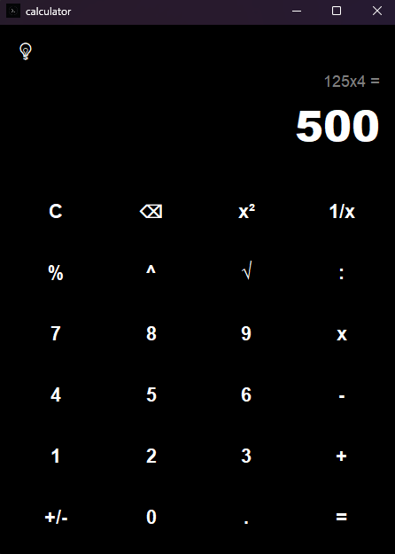
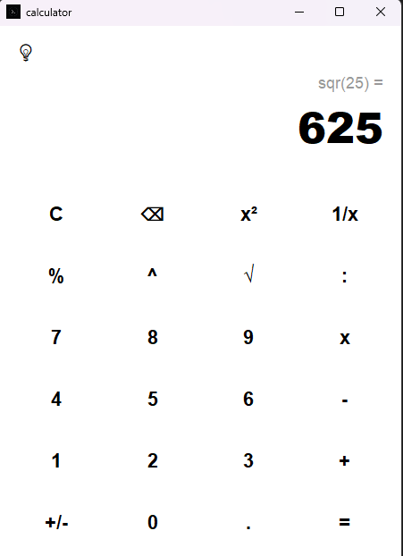

# 🧮 PyCalc

A modern and minimalist GUI calculator built with Python and the `customtkinter` library. With its clean design, the interface looks sharp and fits seamlessly into any minimalist workspace.

🔗 **Project Repository:** [perzonix/PyCalc](https://github.com/perzonix/PyCalc)

---

## ✨ Features

* **Modern Design:** Light and dark theme support with a quick toggle button ("💡").
* **Advanced Logic:** Supports standard operations along with squaring (`x²`), exponents (`^`), square roots (`√`), fractions (`1/x`), sign toggling (`+/-`), and percentages (`%`).
* **Keyboard Support:** Full keyboard integration for digits, operators, clearing (`Escape`), deleting characters (`Backspace`), and evaluating (`Enter`).
* **Calculation History:** Displays the previous expression directly above the primary input field.
* **Custom Icon:** Automatically loads the project logo from the resources folder.

---

## 🖼 Screenshots

<p align="center">
  <br><br>
  
</p>

---

## 📂 Project Structure

* `main.py` — Main execution file to launch the application.
* `src/` — Source code containing application logic (`logic.py`) and UI configuration (`config.py`).
* `assets/` — Project resources (app icon `logo.ico` and screenshots `dark_theme.png.png` / `light_theme.png.png`).
* `requirements.txt` — Project dependencies list.

---

## 🚀 Installation & Setup

1. Ensure you have Python installed on your system.
2. Clone the repository and navigate to the project directory:
   ```bash
   git clone [https://github.com/perzonix/PyCalc.git](https://github.com/perzonix/PyCalc.git)
   cd PyCalc
   ```
3. Install the required dependencies:
   ```bash
   pip install -r requirements.txt
   ```
4. Run the application:
  ```bash
  python main.py
  ```

## ⌨️ Hotkeys & Controls

The application offers full keyboard support:
* `0-9` — Input numbers
* `+`, `-`, `*` (or `x`), `/` — Basic mathematical operations
* `^`, `%` — Exponents and percentage calculation
* `Enter` or `=` — Calculate result
* `Backspace` — Delete the last character (`⌫`)
* `Escape` — Clear the input field and history (`C`)
   
